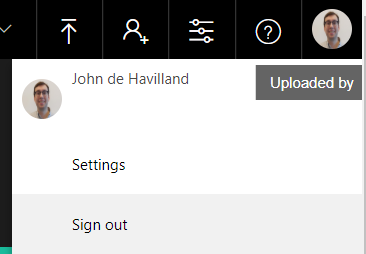

# Brand Identifier

This application identifies custom brands in video

## Setup

### Video Indexer

1. Setup your Video Indexer account. Go to [videoindexer.ai](https://videoindexer.ai) and log in with your corporate account. Once here, click on your name and choose settings.

2. Grab your account id and make a note of it somewhere.

3. Go to [https://api-portal.videoindexer.ai](https://api-portal.videoindexer.ai). 

4. Sign in and go to Products->Authorization and choose Subscribe.

5. Make a note of the Primary Key.

6. Go to [https://videobreakdown.portal.azure-api.net/](https://videobreakdown.portal.azure-api.net/).

7. Sign in and go to Products->Free Preview and subscribe.

8. Grab the Primary key.

### Custom Vision AI

1. Setup Custom Vision AI account - go to [customvision.ai](https://customvision.ai) and sign up (or log in).

2. Create a project.

3. Upload your images, tag them and press train.

4. Under the prediction tab grab the Image endpoint and key

### Deploy the infrastructure and code

1. Deploy the infrastructure components:
    

2. The key values you grabbed from the earlier stages are needed here (leave the rest as is):
* Function App Name - has to be globally unique
* Storage Account Name - has to be globablly unique
* Custom Vision URL - This was grabbed earlier
* Custom Vision Key - this is the access key grabbed earlier
* Video Indexer Id - this is the id of your VI account
* Video Indexer Key - This is the key you grabbed from api-portal.videoindexer.ai
* Video Indexer Key Logic - This is the key you grabbed from videobreakdown.portal.azure-api.net

3. Download the latest FunctionApp zip file from the releases folder in this repo.
6. Navigate to the FunctionApp code deploy page: https://<funtion_name>.scm.azurewebsites.net/ZipDeploy
7. Drag and drop the FunctionApp zip file into the file area on the ZipDeploy page.

### Wire it together

1. Grab the URL for each function app (there are 3)
2. Go to your logic app and choose edit.
3. Scroll down to the 3 http boxes at the end
4. Update the URLs as follows:

8. Go to your storage account and create 2 containers: raw and results
9. Update Logic App with Function App URL.